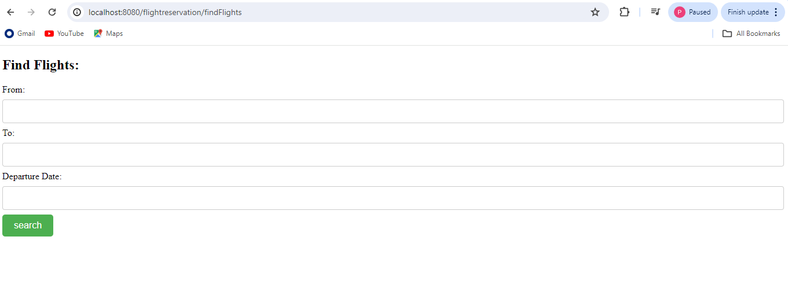
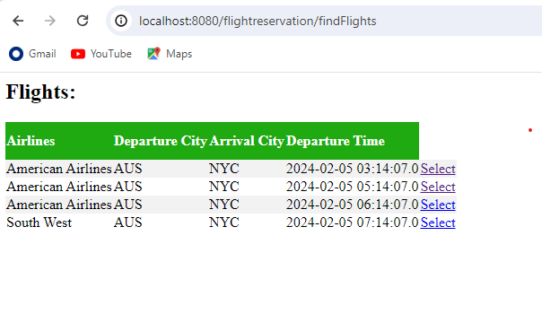
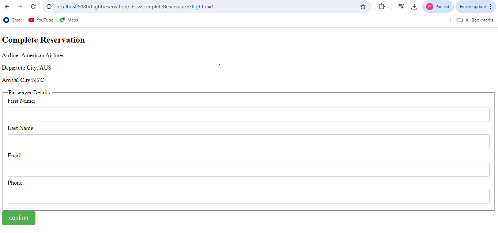
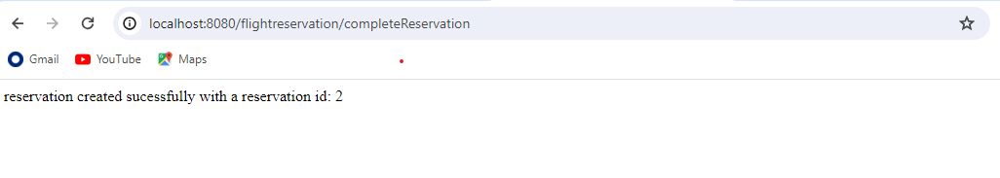

# copilot-demo-github-java

A small demo project to exercise the basic capabilities of Copilot in ***Visual Studio Code***. In this demo you should develop Java coding for Flight reservation that you can access from the UI. We use copilot/chat to help in developing Java coding. Enjoy !

## Pre-Requisits
- Make sure to have...


...correctly installed in Visual Studio Code

...correctly installed in Mysql workbench

...create Database using this 

```
CREATE DATABASE RESERVATION;

USE RESERVATION;

CREATE TABLE FLIGHT
(
  ID INT  NOT NULL AUTO_INCREMENT,
  FLIGHT_NUMBER VARCHAR(20)  NOT NULL, 
  OPERATING_AIRLINES VARCHAR(20)  NOT NULL,
  DEPARTURE_CITY VARCHAR(20)  NOT NULL,
  ARRIVAL_CITY VARCHAR(20)  NOT NULL,
  DATE_OF_DEPARTURE DATE  NOT NULL,
  ESTIMATED_DEPARTURE_TIME TIMESTAMP DEFAULT CURRENT_TIMESTAMP,  
  PRIMARY KEY (ID)
);

CREATE TABLE PASSENGER
(
  ID INT NOT NULL AUTO_INCREMENT,
  FIRST_NAME       VARCHAR(256),
  LAST_NAME    VARCHAR(256),
  MIDDLE_NAME   VARCHAR(256),
  EMAIL VARCHAR(50),
  PHONE VARCHAR(10),
  PRIMARY KEY (ID)
);

CREATE TABLE RESERVATION
(
  ID INT NOT NULL AUTO_INCREMENT,
  CHECKED_IN INT,
  NUMBER_OF_BAGS INT,
  PASSENGER_ID INT,
  FLIGHT_ID INT,
  CREATED TIMESTAMP DEFAULT CURRENT_TIMESTAMP,
  PRIMARY KEY (ID),
  FOREIGN KEY (PASSENGER_ID) REFERENCES PASSENGER(ID) ON DELETE CASCADE,
  FOREIGN KEY (FLIGHT_ID) REFERENCES FLIGHT(ID)
);


insert into flight values(1,'AA1','American Airlines','AUS',
'NYC',STR_TO_DATE('02-05-2024', '%m-%d-%Y'),'2024-02-05 03:14:07');

insert into flight values(2,'AA2','American Airlines','AUS',
'NYC',STR_TO_DATE('02-05-2024', '%m-%d-%Y'),'2024-02-05 05:14:07');

insert into flight values(3,'AA3','American Airlines','AUS',
'NYC',STR_TO_DATE('02-05-2024', '%m-%d-%Y'),'2024-02-05 06:14:07');

insert into flight values(4,'SW1','South West','AUS',
'NYC',STR_TO_DATE('02-05-2024', '%m-%d-%Y'),'2024-02-05 07:14:07');

insert into flight values(5,'UA1','United Airlines','NYC',
'DAL',STR_TO_DATE('02-05-2024', '%m-%d-%Y'),'2024-02-05 10:14:07');

insert into flight values(6,'UA1','United Airlines','NYC',
'DAL',STR_TO_DATE('02-05-2024', '%m-%d-%Y'),'2024-02-05 10:14:07');

insert into flight values(7,'SW1','South West','AUS',
'NYC',STR_TO_DATE('02-06-2024', '%m-%d-%Y'),'2024-02-06 07:14:07');

insert into flight values(8,'SW2','South West','AUS',
'NYC',STR_TO_DATE('02-06-2024', '%m-%d-%Y'),'2024-02-06 08:14:07');

insert into flight values(9,'SW3','South West','NYC',
'DAL',STR_TO_DATE('02-06-2024', '%m-%d-%Y'),'2024-02-06 10:14:07');

insert into flight values(10,'UA1','United Airlines','NYC',
'DAL',STR_TO_DATE('02-06-2024', '%m-%d-%Y'),'2024-02-06 10:14:07');
```

## Generate Entities classes

### Flight.java
- Create folder name 'entities' in this path src\main\java\com\bharath\flightreservation

- Create 'Flight.java' in this path src\main\java\com\bharath\flightreservation\entities

- Delete everything in Flight.java and ask copilot by using ctrl+i open up the chat prompt and type in 

```
flight jpa model class with id, flight number, operating airlines, depature city, arrival city, date of depature, estimated depature time
```
<details><summary>Output</summary> <p>

```
package com.bharath.flightreservation.entities;

import javax.persistence.Entity;
import javax.persistence.GeneratedValue;
import javax.persistence.GenerationType;
import javax.persistence.Id;
import java.util.Date;


@Entity
public class Flight {

    @Id
    @GeneratedValue(strategy = GenerationType.IDENTITY)
    private Long id;

    private String flightNumber;
    private String operatingAirlines;
    private String departureCity;
    private String arrivalCity;
    private Date departureDate;
    private String estimatedDepartureTime;

    // Constructors, getters, and setters

}
```
</p> </details>

- As copilot gives javax it is not a right package so replace with the jakarta 

- If you get Constructors, getters, and setters remove all of them as it in this project we will use biult in templates that are available in this path src\main\resources\templates

- The 'private String estimatedDepartureTime;' should not be a string it should be Timestamp from java.sql

- Add  @Column(name = "DATE_OF_DEPARTURE") at the above of the 'private Date departureDate;' step final code should be 

- Add @Data annotation from lombok just after this '@Entity' step.

- The corrected code for 'Flight.java' is

<details><summary>Output</summary> <p>

```
package com.bharath.flightreservation.entities;

import jakarta.persistence.Column;
import jakarta.persistence.Entity;
import jakarta.persistence.GeneratedValue;
import jakarta.persistence.GenerationType;
import jakarta.persistence.Id;
import lombok.Data;

import java.sql.Timestamp;
import java.util.Date;

 
@Entity
@Data
public class Flight {

    @Id
    @GeneratedValue(strategy = GenerationType.IDENTITY)
    private Long id;

    private String flightNumber;
    private String operatingAirlines;
    private String departureCity;
    private String arrivalCity;
    @Column(name = "DATE_OF_DEPARTURE")
    private Date departureDate;
    private Timestamp estimatedDepartureTime;

    // Add constructors, getters, and setters here

}
```
</p> </details>


### Passenger.java

- Create 'Passenger.java' in this path src\main\java\com\bharath\flightreservation\entities.

- Delete everything in Passenger.java and ask copilot by using ctrl+i open up the chat prompt and type in 

```
Passenger jpa model class with id, first name, last name, middle name, email, phone
```

<details><summary>Output</summary> <p>

```
package com.bharath.flightreservation.entities;

import jakarta.persistence.Entity;
import jakarta.persistence.GeneratedValue;
import jakarta.persistence.GenerationType;
import jakarta.persistence.Id;


@Entity
public class Passenger {

    @Id
    @GeneratedValue(strategy = GenerationType.IDENTITY)
    private Long id;

    private String firstName;
    private String lastName;
    private String middleName;
    private String email;
    private String phone;

    // Constructors, getters, and setters

}
```
</p> </details>

- As copilot gives javax it is not a right package so replace with the 'jakarta' 

- If you get Constructors, getters, and setters remove all of them as it in this project we will use biult in templates that are available in this path src\main\resources\templates.

- Add @Data annotation from lombok just after this '@Entity' step.

- The corrected code for 'Passenger.java' is

<details><summary>Output</summary> <p>

```
package com.bharath.flightreservation.entities;

import jakarta.persistence.Entity;
import jakarta.persistence.GeneratedValue;
import jakarta.persistence.GenerationType;
import jakarta.persistence.Id;
import lombok.Data;


@Entity
@Data
public class Passenger {

    @Id
    @GeneratedValue(strategy = GenerationType.IDENTITY)
    private Long id;
    private String firstName;
    private String lastName;
    private String middleName;
    private String email;
    private String phone;

    // Constructors, getters, and setters

}
```
</p> </details>

### Reservation.java

- Create 'Reservation.java' in this path src\main\java\com\bharath\flightreservation\entities.

- Delete everything in Reservation.java and ask copilot by using ctrl+i open up the chat prompt and type in 

```
Reservation jpa model class with id, checked in, number of bags, passenger, flight
```

<details><summary>Output</summary> <p>

```
package com.bharath.flightreservation.entities;

import jakarta.persistence.*;


public class Reservation {
    
}
@Entity
@Table(name = "reservation")
public class Reservation {

    @Id
    @GeneratedValue(strategy = GenerationType.IDENTITY)
    private Long id;

    @Column(name = "checked_in")
    private boolean checkedIn;

    @Column(name = "number_of_bags")
    private int numberOfBags;

    @OneToOne
    private Passenger passenger;

    @OneToOneToOne
    private Flight flight;

    // Add getters and setters for all the fields

    // Add constructors and other methods as needed

}
```
</p> </details>

- As copilot gives javax it is not a right package so replace with the 'jakarta' 

- If you get Constructors, getters, and setters remove all of them as it in this project we will use biult in templates that are available in this path src\main\resources\templates.

- Add @Data annotation from lombok just after this '@Entity' step.

- The corrected code for 'Reservation.java' is

<details><summary>Output</summary> <p>

```
package com.bharath.flightreservation.entities;

import jakarta.persistence.*;
import lombok.Data;


@Entity
@Data
@Table(name = "reservation")
public class Reservation {

    @Id
    @GeneratedValue(strategy = GenerationType.IDENTITY)
    private Long id;

    @Column(name = "checked_in")
    private boolean checkedIn;

    @Column(name = "number_of_bags")
    private int numberOfBags;

    @OneToOne
    private Passenger passenger;

    @OneToOne
    private Flight flight;

}
```
</p> </details>


## Generate Repository interfaces

### Create FlightRepository.java
- Create folder name 'repos' in this path src\main\java\com\bharath\flightreservation

- Create 'FlightRepository.java' in this path src\main\java\com\bharath\flightreservation\repos

- Delete everything in FlightRepository.java and openup Flight.java and copilot chat select entire code and typein chat box

```
Flight jpa repository that uses flight model
```
<details><summary>Output</summary> <p>

```

package com.bharath.flightreservation.repos;

import com.bharath.flightreservation.entities.Flight;
import org.springframework.data.jpa.repository.JpaRepository;

public interface FlightRepository extends JpaRepository<Flight, Long> {
    // Custom queries can be added here
}
```
</p> </details>

### Create PassengerRepository.java

- Create 'PassengerRepository.java' in this path src\main\java\com\bharath\flightreservation\repos

- Copy entire code from 'FlightRepository.java' and inplace of  "FlightRepository" replace with "PassengerRepository" the same with "Flight" replace with "Passenger".

- The final code should be ike this:

<details><summary>Output</summary> <p>

```
package com.bharath.flightreservation.repos;


import com.bharath.flightreservation.entities.Passenger;

import org.springframework.data.jpa.repository.JpaRepository;

public interface PassengerRepository extends JpaRepository<Passenger, Long> {
    // Define your custom queries here if needed
}
```
</p> </details>

### Create ReservationRepository.java

- Create 'ReservationRepository.java' in this path src\main\java\com\bharath\flightreservation\repos

- Copy entire code from 'FlightRepository.java' and inplace of  "FlightRepository" replace with "ReservationRepository" the same with "Flight" replace with "Reservation".

- The final code should be ike this:

<details><summary>Output</summary> <p>

```
package com.bharath.flightreservation.repos;

import com.bharath.flightreservation.entities.Reservation;

import org.springframework.data.jpa.repository.JpaRepository;

public interface ReservationRepository extends JpaRepository<Reservation, Long> {
    // Define your custom queries here if needed
}
```
</p> </details>

## Generate controllers layer

### FlightController.java
- Create folder name 'controllers' in this path src\main\java\com\bharath\flightreservation

- Create 'FlightController.java' in this path src\main\java\com\bharath\flightreservation\controllers

- Delete everything in FlightController.java and ask copilot by using ctrl+i open up the chat prompt and type in 

```
Flight controller class with a displayfindflights method that returns the thymeleaf template
```
<details><summary>Output</summary> <p>

```
package com.bharath.flightreservation.controllers;

import org.springframework.stereotype.Controller;
import org.springframework.ui.Model;
import org.springframework.web.bind.annotation.GetMapping;


@Controller
public class FlightController {

    @GetMapping("/find-flights")
    public String displayFindFlights(Model model) {
        
        return "find-flights"; // Return the Thymeleaf template name
    }
}
```
</p> </details>

- If you get  models in this step `public String displayFindFlights(Model model)` remove everyting and keep it empty like this
`public String displayFindFlights()`

- Hers is the final code:

<details><summary>Output</summary> <p>

```
package com.bharath.flightreservation.controllers;

import org.springframework.stereotype.Controller;
import org.springframework.web.bind.annotation.GetMapping;


@Controller
public class FlightController {

    @GetMapping("/find-flights")
    public String displayFindFlights() {
        
        return "find-flights";
    }
}
```
</p> </details>

- Open the application.properties in src\main\resources\application.properties
- Replace your username & password inorder to connect to the database
- RUN the application and open your chrome and hit `http://localhost:8080/flightreservation/findFlights` you see page something like this



The application is working but it is not complete like if you select `From: AUS`  `To: NYC` and  `Departure Date: 02-05-2024` and hit `search` you need to get flight details to accomplish this we need to add few steps in the FlightController.java with post operation


### Implement find flights
Open the FlightController.java select entire code type in copilot chat

```
Find flights method that take from,to, depaturedate fetches flight using the flight repository and sends them to the displayFlights thymeleaf template
```

<details><summary>Output</summary> <p>

```

package com.bharath.flightreservation.controllers;

import com.bharath.flightreservation.entities.Flight;
import com.bharath.flightreservation.repos.FlightRepository;
import org.springframework.beans.factory.annotation.Autowired;
import org.springframework.format.annotation.DateTimeFormat;
import org.springframework.stereotype.Controller;
import org.springframework.ui.Model;
import org.springframework.web.bind.annotation.GetMapping;
import org.springframework.web.bind.annotation.PostMapping;
import org.springframework.web.bind.annotation.RequestParam;

import java.util.Date;
import java.util.List;


@Controller
public class FlightController {

    @Autowired  
    private FlightRepository flightRepository;

    @GetMapping("/findFlights")
    public String displayFindFlights() {
        return "findFlights";   
    }

    @GettMapping("/findFlights")
    public String findFlights(@RequestParam("from") String from, @RequestParam("to") String to, @RequestParam("departureDate") Date departureDate, Model model) {
        List<Flight> flights = flightRepository.findFlights(from, to, departureDate);
        model.addAttribute("flights", flights);
        return "displayFlights";
    }
}
```
</p> </details>

- Edit the code like instead of `@GetMapping` make it as `@PostMapping` in the second '@GetMapping'.
- Add a Date Time Pattern here `public String findFlights(@RequestParam("from") String from, @RequestParam("to") String to, @RequestParam("departureDate") Date departureDate, Model model) {`
like this `public String findFlights(@RequestParam("from") String from, @RequestParam("to") String to, @RequestParam("departureDate") @DateTimeFormat(pattern = "MM-dd-yyyy") Date departureDate, Model model) {`

- Final code should be like this:

<details><summary>Output</summary> <p>

```
package com.bharath.flightreservation.controllers;

import com.bharath.flightreservation.entities.Flight;
import com.bharath.flightreservation.repos.FlightRepository;
import org.springframework.beans.factory.annotation.Autowired;
import org.springframework.format.annotation.DateTimeFormat;
import org.springframework.stereotype.Controller;
import org.springframework.ui.Model;
import org.springframework.web.bind.annotation.GetMapping;
import org.springframework.web.bind.annotation.PostMapping;
import org.springframework.web.bind.annotation.RequestParam;

import java.util.Date;
import java.util.List;


@Controller
public class FlightController {

    @Autowired  
    private FlightRepository flightRepository;

    @GetMapping("/findFlights")
    public String displayFindFlights() {
        return "findFlights";   
    }

    @PostMapping("/findFlights")
    public String findFlights(@RequestParam("from") String from, @RequestParam("to") String to, @RequestParam("departureDate") @DateTimeFormat(pattern = "MM-dd-yyyy") Date departureDate, Model model) {
        List<Flight> flights = flightRepository.findFlights(from, to, departureDate);
        model.addAttribute("flights", flights);
        return "displayFlights";
    }
}
```
</p> </details>

- You dont have find `findFlights` method so select entire code in FlightController.java and type in copilot chat

```
Create find flight method in the flight repository
```

- Open the FlightRepository.java and add the code. Final code will be:


<details><summary>Output</summary> <p>

```
package com.bharath.flightreservation.repos;

import com.bharath.flightreservation.entities.Flight;
import org.springframework.data.jpa.repository.JpaRepository;

import org.springframework.data.jpa.repository.Query;
import org.springframework.data.repository.query.Param;

import java.util.Date;
import java.util.List;

public interface FlightRepository extends JpaRepository<Flight, Long> { 
    @Query("SELECT f FROM Flight f WHERE f.departureCity = :from AND f.arrivalCity = :to AND f.departureDate = :departureDate")
    List<Flight> findFlights(@Param("from") String from, @Param("to") String to, @Param("departureDate") Date departureDate);
}


```
</p> </details>


- Open the application.properties in src\main\resources\application.properties
- Replace your username & password inorder to connect to the database
- RUN the application and open your chrome and hit `http://localhost:8080/flightreservation/findFlights` you see page something like this


- Once you select `From: AUS`  `To: NYC` and  `Departure Date: 02-05-2024` and hit `search` you need to get flight details like this



- Again this is not complete

### Implement Show Complete Reservation

- Create ReservationController.java in this path src\main\java\com\bharath\flightreservation\controllers

- Delete everything and ctrl+I give prompt like this

```
reservation controller with a show complete reservation method that takes the flight id, fetches the filght details using flight repository and sends them to the complete reservation thymeleaf template
```

<details><summary>Output</summary> <p>

```
package com.bharath.flightreservation.controllers;

import com.bharath.flightreservation.entities.Flight;
import com.bharath.flightreservation.repos.FlightRepository;
import org.springframework.beans.factory.annotation.Autowired;
import org.springframework.stereotype.Controller;
import org.springframework.ui.Model;
import org.springframework.web.bind.annotation.GetMapping;
import org.springframework.web.bind.annotation.PathVariable;

@Controller
public class ReservationController {

    @Autowired
    private FlightRepository flightRepository;

    @GetMapping("/completeReservation/{flightId}")
    public String showCompleteReservation(@PathVariable("flightId") Long flightId, Model model) {
        Flight flight = flightRepository.findById(flightId).orElseThrow(() -> new IllegalArgumentException("Invalid flight Id:" + flightId));
        model.addAttribute("flight", flight);
        return "completeReservation";
    }
}
```
</p> </details>

- Instead of `@PathVariable` replace with `@RequestParam`

- RUN the application and open your chrome and hit `http://localhost:8080/flightreservation/findFlights` you see page something like this



### Implement DTO and reservation service

- Create `dtos` folder in this path src\main\java\com\bharath\flightreservation

-  Cerate `ReservationRequest.java` in this path src\main\java\com\bharath\flightreservation\dtos

- Delete everything and openup your open up the chat prompt using ctrl+I and provide prompt

```
reservation request with a flight id, first name, last name, email and phone
```

<details><summary>Output</summary> <p>

```
package com.bharath.flightreservation.dtos;


public class ReservationRequest {
    private Long flightId;
    private String firstName;
    private String lastName;
    private String email;
    private String phone;

}
```
</p> </details>

- Add `@Data` in the ReservationRequest.java & final code like this

<details><summary>Output</summary> <p>

```
package com.bharath.flightreservation.dtos;

import lombok.Data;

@Data
public class ReservationRequest {
    private Long flightId;
    private String firstName;
    private String lastName;
    private String email;
    private String phone;

}
```
</p> </details>


- Create a `services` folder in this path src\main\java\com\bharath\flightreservation

- Create `ReservationService.java` in this path src\main\java\com\bharath\flightreservation\services

- Add thi step `public Reservation bookFlight(ReservationRequest request);` in the `public interface` step.

- Create `ReservationServiceImpl.java` in this path src\main\java\com\bharath\flightreservation\service

- Add this code in `ReservationServiceImpl.java`

<details><summary>Output</summary> <p>

```
package com.bharath.flightreservation.services;

import org.springframework.beans.factory.annotation.Autowired;

import org.springframework.stereotype.Service;

import com.bharath.flightreservation.dtos.ReservationRequest;
import com.bharath.flightreservation.entities.Reservation;
import com.bharath.flightreservation.repos.FlightRepository;
import com.bharath.flightreservation.repos.PassengerRepository;
import com.bharath.flightreservation.repos.ReservationRepository;
import com.bharath.flightreservation.entities.Flight;
import com.bharath.flightreservation.entities.Passenger;


@Service
public class ReservationServiceImpl implements ReservationService {

    @Autowired
    FlightRepository flightRepository;

    @Autowired
    PassengerRepository passengerRepository;

    @Autowired
    ReservationRepository reservationRepository;

    @Override
    public Reservation bookFlight(ReservationRequest request) {

        Flight flight = flightRepository.findById(request.getFlightId()).get();

        Passenger passenger = new Passenger();
        passenger.setFirstName(request.getFirstName());
        passenger.setLastName(request.getLastName());
        passenger.setEmail(request.getEmail());
        passenger.setPhone(request.getPhone());

        Passenger savedPassenger = passengerRepository.save(passenger);

        Reservation reservation = new Reservation();
        reservation.setFlight(flight);
        reservation.setPassenger(savedPassenger);
    
        Reservation savedReservation = reservationRepository.save(reservation);


        return savedReservation;
    }
}
```
</p> </details>

- Open up `ReservationController.java` add `@PostMapping` method, service which is `ReserationService` the complete code should be like this

<details><summary>Output</summary> <p>

```
package com.bharath.flightreservation.controllers;

import com.bharath.flightreservation.dtos.ReservationRequest;
import com.bharath.flightreservation.entities.Flight;
import com.bharath.flightreservation.entities.Reservation;
import com.bharath.flightreservation.repos.FlightRepository;
import com.bharath.flightreservation.services.ReservationService;

import org.springframework.beans.factory.annotation.Autowired;
import org.springframework.stereotype.Controller;
import org.springframework.ui.Model;
import org.springframework.web.bind.annotation.GetMapping;
import org.springframework.web.bind.annotation.PostMapping;
import org.springframework.web.bind.annotation.RequestParam;

@Controller
public class ReservationController {

    @Autowired
    private FlightRepository flightRepository;

    @Autowired
    private ReservationService reservationService;

    @GetMapping("/showCompleteReservation")
    public String showCompleteReservation(@RequestParam("flightId") Long flightId, Model model) {
        Flight flight = flightRepository.findById(flightId).orElseThrow(() -> new IllegalArgumentException("Invalid flight Id:" + flightId));
        model.addAttribute("flight", flight);
        return "completeReservation";
    }

    @PostMapping("/completeReservation")
    public String completeReservation(ReservationRequest request, Model model) {

        Reservation reservation = reservationService.bookFlight(request);
        model.addAttribute("msg", "reservation created sucessfully with a reservation id: "+ reservation.getId());
        return "reservationConfirmation";
    }
}
```
</p> </details>

- RUN the application and after entering passenger details you see page something like this




